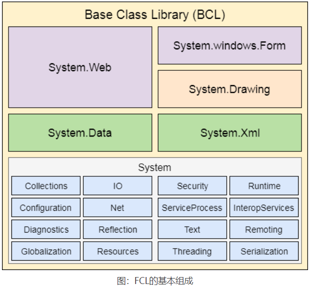

# .NET Framework
## .NET Framework是什么
	.NET Framework 是一个由微软设计和开发的软件框架，主要用来开发可以在 Windows 平台上运行的应用程序，例如 Web、Windows 和移动端的各种应用程序，
	框架中提供了包括网络、安全性、内存管理和类型安全在内的各种服务.
*** 

## .NET Framework的构成
	.NET Framework 主要由四个部分构成，如下所示：
	公共语言运行库（CLR）；
	框架类库（FCL）；
	核心语言（WinForms、ASP.NET 和 ADO.NET）；
	其他模块（WCF、WPF、WF、Card Space、LINQ、Entity Framework、Parallel LINQ、Task Parallel Library 等）。

*** 
## CLR：公共语言运行库
	CLR 全称为“Common Language Runtime”，
	它为 .NET 应用程序提供了一个托管的代码执行环境（类似 Java 中的虚拟机），
	是整个 .NET 框架的核心。实际上 CLR 是驻留在内存里的一段代码，
	负责程序执行期间的代码管理工作，
	例如内存管理、线程管理、安全管理、远程管理、即时编译等。下图中展示了 CLR 的组成：

	关于上图中所示各个部分的说明，如下所示：
	Base Class Library Support（基础类库）：一个类库，为 .NET 应用程序提供了一些类；
	Thread Support（线程支持）：用来管理多线程应用程序的并行执行；
	COM Marshaler（COM 封送处理程序）：提供 COM 对象与应用程序之间的通信；
	Type Checker（类型检查器）：检查应用程序中使用的类型，并验证它们是否与 CLR 提供的标准类型匹配；
	Code Manager（代码管理器）：在程序运行时管理代码；
	Garbage Collector（垃圾回收器）：释放未使用的内存，并将其分配给新的应用程序；
	Exception Handler（异常管理器）：在程序运行时处理异常，避免应用程序运行失败；
	Class Loader（类加载器）：在运行时加载所有的类。
*** 
## FCL：框架类库
	FCL 全称为“Framework Class Library”，它是一个标准库，其中包含了成千上万个类，主要用于构建应用程序。
	FCL 的核心是 BCL（Base Class Library：基础类库），BCL 提供了 FCL 的基本功能。FCL 的基本组成如下所示：

*** 

## WinForms
	WinForms 是 Windows Forms 的简称，它是一种 .NET Framework 的智能客户端技术，用来开发可以在我们电脑中运行的应用程序，我们经常使用的记事本就是使用 WinForms 技术开发的。
## ASP.NET
	ASP.NET 是一个微软设计和开发的 Web 框架，于 2002 年 1 月首次发布，ASP.NET 中完美的集成了 HTML、CSS 和 JavaScript。可以使用 ASP.NET 来开发网站、Web 应用程序和 Web 服务。
## ADO.NET
	ADO.NET 一个是 .Net Framework 的模块，由可用于连接、检索、插入和删除数据的类组成，主要用来开发能够与 SQL Server、Oracle 等数据库进行交互的应用程序。
## WPF
	WPF 全称为“Windows Presentation Foundation”，是微软推出的基于 Windows 的用户界面框架，主要用来设计 Windows 应用程序的用户界面。WPF 以前也叫“Avalon”，集成在 .NET Framework 中，2006 发布的 .NET Framework 3.0 是最早支持 WPF 的。
## WCF
	WCF 全称为“Windows Communication Foundation”，是由微软开发的支持数据通信的应用程序框架，中文翻译为 Windows 通讯开发平台。
	与 WPF 相同，WCF 最早也是集成在 .NET Framework 3.0 中，WCP、WPF 和 WF 被统称为新一代 Windows 操作系统以及 WinFX（Windows Vista 的托管代码编程模型）的三个重大应用程序开发类库。
	WCF 整合了 Windows 通讯中的 .net Remoting、WebService、Socket 机制，并融合了 HTTP 和 FTP 的相关技术，因此尤其适合 Windows 平台上分布式应用的开发。
## WF
	WF 全称为“Windows Workflow Foundation”，是微软提供的一项技术，其中提供 API、进程内工作流引擎和可重新托管的设计器，用来将长时间运行的进程实现为 .NET 应用程序中的工作流。
## LINQ
	LINQ 技术在 2007 年跟随 .NET Framework 3.5 一同发布，其全称为“Language Integrated Query”，是微软的一项技术，新增了一种自然查询的 SQL 语法到 .NET Framework 的编程语言中，当前支持 C# 以及 Visual Basic .NET 语言。
## Entity Framework
	Entity Framework 是一个基于 ORM 的开源框架，可以和使用 .NET 对象的数据库一起使用。它可以减轻程序员在处理数据库方面的工作，是微软推荐使用的处理数据库的技术。
## Parallel LINQ
	Parallel LINQ 也叫 PLINQ，是对 LINQ 技术的并行实现，PLINQ 将 LINQ 语法的简洁和可靠性与并行编程的强大功能结合在一起，大大提高了使用 LINQ 时的运行速度。
