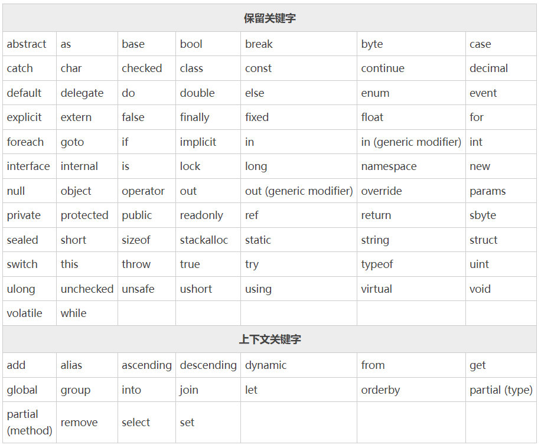

# Csharp 关键字
	C# 中的关键字是编译器预先定义好的一些单词，也可以称为保留字或者保留标识符，这些关键字对编译器有特殊的意义，不能用作标识符。
	但是，如果您非要使用的话也不是没有办法，只需要在关键字前面加上@前缀即可，例如@if就是一个有效的标识符，而if则是一个关键字。

	在 C# 中，有些关键字在代码的上下文中具有特殊的意义，例如 get 和 set，这样的关键字被称为上下文关键字（contextual keywords）。
	一般来说，C# 语言中新增的关键字都会作为上下文关键字，这样可以避免影响到使用旧版语言编写的 C# 程序。

