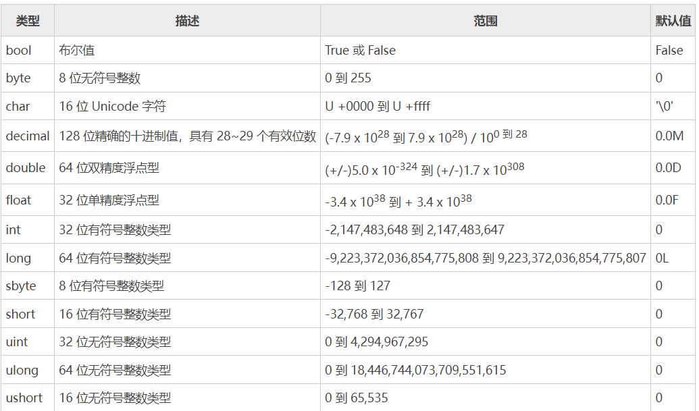

# C#数据类型
C# 语言中内置了一些基本的数据类型，数据类型用来指定程序中变量可以存储的数据的类型，C# 中的数据类型可以大致分为三类：
- 值类型（Value types）；
- 引用类型（References types）；
- 指针类型（Pointer types）。

## 值类型

	C# 中的值类型是从 System.ValueType 类中派生出来的，对于值类型的变量我们可以直接为其分配一个具体的值。
	当声明一个值类型的变量时，系统会自动分配一块儿内存区域用来存储这个变量的值，
	需要注意的是，变量所占内存的大小会根据系统的不同而有所变化


如果想要获取类型或变量的确切大小，可以使用 sizeof 方法，示例代码如下：

```C#
using System;
namespace 数据类型{
    class Program {
        static void Main(string[] args) {
            Console.WriteLine("int 类型的大小为: {0}", sizeof(int));
            Console.ReadLine();
        }
    }
}
```

## 引用类型
    引用类型的变量中并不存储实际的数据值，而是存储的对数据（对象）的引用，换句话说就是，引用类型的变量中存储的是数据在内存中的位置。当多个变量都引用同一个内存地址时，如果其中一个变量改变了内存中数据的值，那么所有引用这个内存地址的变量的值都会改变。C# 中内置的引用类型包括 Object（对象）、Dynamic（动态）和 string（字符串）。
  
### 1) 对象类型（Object）
    
    对象类型是 C# 通用类型系统（Common Type System：CTS）中所有数据类型的最终基类，Object 是 System.Object 类的别名。任何类型的值都可以分配给对象类型，但是在分配值之前，需要对类型进行转换。

    将值类型转换为对象类型的过程被称为“装箱”，反之将对象类型转换为值类型的过程则被称为“拆箱”。注意，只有经过装箱的数据才能进行拆箱。
### 2) 动态类型（Dynamic）
    您可以在动态类型的变量中存储任何类型的值，这些变量的类型检查是在程序运行时进行的。动态类型的声明语法如下所示：
    dynamic <variable_name> = value;

    例如：
    dynamic d = 20;

    动态类型与对象类型类似，但对象类型变量的类型检查是在编译时进行的，而动态类型变量的类型检查则是在程序运行时进行的。
### 3) 字符串类型（String）
    字符串类型的变量允许您将一个字符串赋值给这个变量，字符串类型需要通过 String 类来创建，String 类是 System.String 类的别名，它是从对象（Object）类型中派生的。在 C# 中有两种定义字符串类型的方式，分别是使用" "和@" "。

    示例代码如下：
    //使用引号的声明方式
    String str = "数据类型";
    //使用 @ 加引号的声明形式
    @"数据类型";

    使用@" "形式声明的字符串称为“逐字字符串”，逐字字符串会将转义字符\当作普通字符对待，例如string str = @"C:\Windows";等价于string str = "C:\\Windows";。

    另外，在@" "形式声明的字符串中可以任意使用换行，换行符及缩进空格等都会计算在字符串的长度之中。
## 指针类型
    C# 语言中的指针是一个变量，也称为定位器或指示符，其中可以存储另一种类型的内存地址。C# 中的指针与 C 或 C++ 中的指针具有相同的功能。

    指针类型的声明语法如下所示：
    type* identifier;

    例如：
    char* cptr;
    int* iptr;