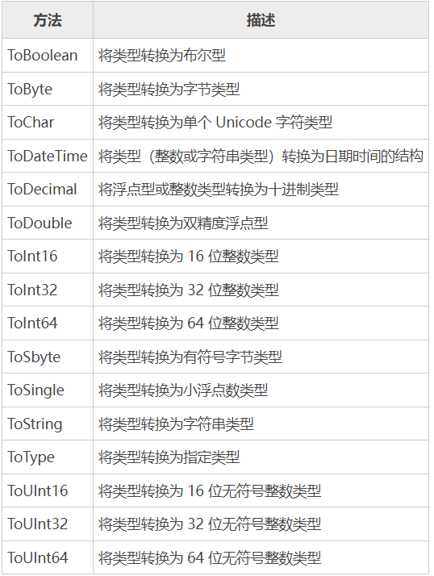

# C#数据类型转换
## 1、隐式类型转换
    隐式类型转换是由 C# 以类型安全的方式执行的，转换的过程中不会导致数据丢失，
    例如从较小的整数类型（例如 int）转换到较大的整数类型（例如 long），从派生类转换为基类。

隐式转换不需要我们编写额外的代码，下例中演示了如何使用隐式类型转换的方式将 int 类型的数据转换成 double 类型：
```C#
int a = 10;
double b = a;
```


    提示：一种数据类型（类型 A），只要其取值范围完全包含在另一种数据类型（类型 B）的取值范围内，那么类型 A 就可以隐式转换为类型 B。基于这一特性，C# 的隐式类型转换不会导致数据丢失。

## 2、显式类型转换
    显式类型转换也叫强制类型转换，这种转换需要使用(type)value的形式或者预定义函数显式的完成，
    显式转换需要用户明确的指定要转换的类型，而且在转换的过程中可能会造成数据丢失，例如将 double 类型转换为 int 类型。

下面通过一个示例来演示一下显式类型转换：
```c#
using System;
namespace 数据类型转换{
    class ExplicitConversion {
        static void Main(string[] args) {
            double d = 5673.74;
            int i;
        
            // 将 double 类型转换为 int
            i = (int)d;
            Console.WriteLine("转换前{0}，转换后{1}", d, i);
            Console.ReadKey();
        }
    }
}
```
编译并执行上述代码，运行结果如下：
转换前5673.74，转换后5673
### C# 中还提供了一系列内置的类型转换方法，如下表所示：

*** 
【示例】使用上面提供的方法，将各种类型的数据转换为字符串类型：
```C#
using System;

namespace 数据类型转换{
    class StringConversion {
        static void Main(string[] args) {
            int i = 75;
            float f = 53.005;
            double d = 2345.7652;
            bool b = true;

            Console.WriteLine(i.ToString());
            Console.WriteLine(f.ToString());
            Console.WriteLine(d.ToString());
            Console.WriteLine(b.ToString());
            Console.ReadKey();
        }
    }
}
```
    编译并执行上述代码，运行结果如下：
    75
    53.005
    2345.7652
    True