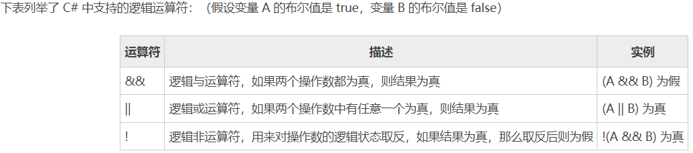
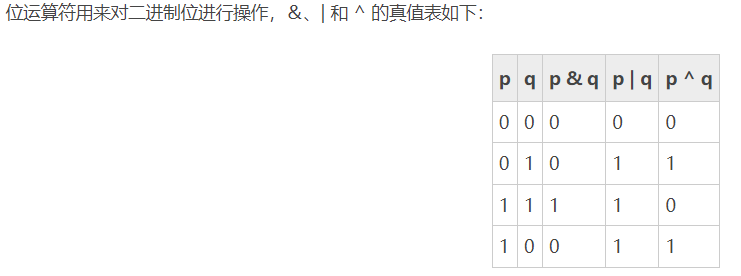
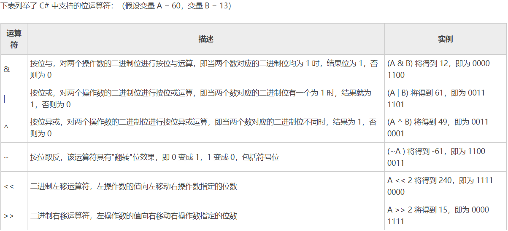
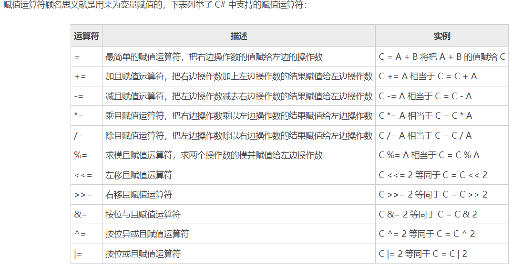
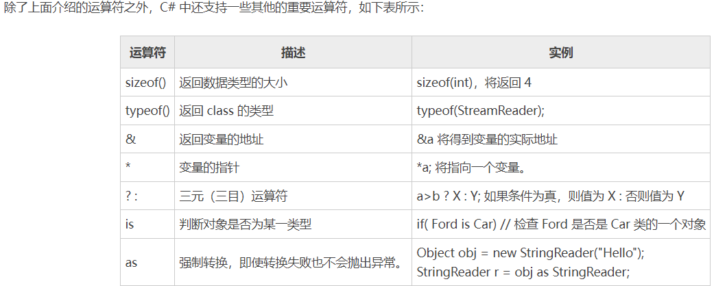

# Csharp 运算符







```C#
using System;

namespace 运算符
{
    class Demo
    {
        static void Main(string[] args)
        {
            int a = 10;
            int b = 20;

            Console.WriteLine("a / b = {0}", a / b);//a / b = 0
            Console.WriteLine("a % b = {0}", a % b);//a % b = 10
            Console.WriteLine("++a 的值是 {0}", ++a);//++a 的值是 11
            a = 10; // 重新给变量 a 赋值
            Console.WriteLine("a-- 的值是 {0}", a--);//a-- 的值是 10
            Console.WriteLine("a 的值是 {0}", a);//a 的值是 9
            Console.ReadLine();

             
            int a = 60;            /* 60 = 0011 1100 */ 
            int b = 13;            /* 13 = 0000 1101 */
            int c = 0;         
            c = a & b;           /* 12 = 0000 1100 */
            Console.WriteLine("a & b 的值是 {0}", c );
            c = a | b;           /* 61 = 0011 1101 */
            Console.WriteLine("a | b 的值是 {0}", c);
            c = a ^ b;           /* 49 = 0011 0001 */
            Console.WriteLine("a ^ b 的值是 {0}", c);
            c = ~a;               /*-61 = 1100 0011 */
            Console.WriteLine("~a 的值是 {0}", c);
            c = a << 2;     /* 240 = 1111 0000 */
            Console.WriteLine("a << 2 的值是 {0}", c);
            c = a >> 2;     /* 15 = 0000 1111 */
            Console.WriteLine("a >> 2 的值是 {0}", c);
            Console.ReadLine();
        

            c = 123;
            c %= a;
            Console.WriteLine("c %= a 的值为 {0}", c);//c %= a 的值为 24
            c <<= 2;
            Console.WriteLine("c <<= 2 的值为 {0}", c);//c <<= 2 的值为 96
            c >>= 2;
            Console.WriteLine("c >>= 2 的值为 {0}", c);//c >>= 2 的值为 24
            c &= 2;
            Console.WriteLine("c &= 2 的值为 {0}", c);//c &= 2 的值为 0
            c ^= 2;
            Console.WriteLine("c ^= 2 的值为 {0}", c);//c ^= 2 的值为 2
            c |= 2;
            Console.WriteLine("c |= 2 的值为 {0}", c);//c |= 2 的值为 2


            /* sizeof 运算符的实例 */
            Console.WriteLine("int 的大小是 {0}", sizeof(int));//int 的大小是 4
            Console.WriteLine("short 的大小是 {0}", sizeof(short));//short 的大小是 2
            Console.WriteLine("double 的大小是 {0}", sizeof(double));//double 的大小是 8
        
            /* 三元运算符的实例 */
            int a, b;
            a = 11;
            b = (a == 1) ? 20 : 30;
            Console.WriteLine("b 的值是 {0}", b);//b 的值是 30
            b = (a == 11) ? 20 : 30;
            Console.WriteLine("b 的值是 {0}", b);//b 的值是 20
        }
    }
}


````